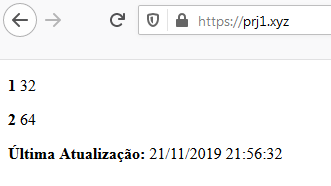

# gsmEnviaSMS-Website

Códigos feitos majoritariamoente para o back-end do nosso servidor e Website, facilitando o redirecionamento dos dados recebidos pelo SMS. Exemplo de output de SMS que será enviado ao servidor:

# teste.teste/n.php?c=25&u=67, onde:

-> 'teste.teste' = Seu domínio particular;

-> '/n.php' = O código em PHP que está recebendo esses dados e os redirecionando;

->'?c=25&u=67' = Os valores de temperatura (ºC) e Umidade Relativa do Ar (%) que estão vindo através do sensor DHT11.

# Contribuição dos códigos em PHP e HTML: Luan M. de Oliveira
